# UX Design Specification crowd-codes

**Author:** Justin
**Date:** 2026-01-19

---

## Executive Summary

### Project Vision

Crowd-codes is an **anti-pattern promo code platform** — the exact opposite of existing solutions like radins.com or lareduction.fr. No popups, no ads, no "Reveal Code" buttons. Codes are immediately visible, sorted by freshness.

**Core philosophy:** "The site that doesn't take you for a fool"

Radical transparency: public success rates, public stats, open source. The absence of friction IS the product.

### Target Users

| Persona | Context | Need | Time Constraint |
|---------|---------|------|-----------------|
| **Lucas** (rushed buyer) | Cart open, "promo code" field visible | Find a working code | **< 30 seconds** |
| **Justin** (maintainer) | Morning coffee, quick check | Monitor + improve parsing | **< 5 min/day** |

**Dominant device:** Mobile (60%+ expected traffic)

**User mindset:** Lucas is already mid-purchase, context-switching from another site. He's skeptical (burned by fake codes before) but hopeful. Every millisecond of friction increases bounce risk.

### Key Design Challenges

1. **Absolute speed** — Lucas must find → copy → paste in under 5 seconds
2. **Instant trust** — Show code validity likelihood without explicit user feedback
3. **Empathetic empty states** — "No Decathlon code" must explain WHY, not just state the absence
4. **Mobile thumb-zone** — Copy buttons must be thumb-accessible, not at screen top

### Design Opportunities

1. **Trust micro-interactions** — Satisfying "Copied!" feedback, visual freshness indicators
2. **Zero-friction as brand** — Absence of friction IS the design (every removed element = UX win)
3. **Transparency as feature** — The /stats page becomes a trust-building marketing element

## Core User Experience

### Defining Experience

The core user action is **Search → Copy → Paste** in under 5 seconds. This is the "core loop" that defines crowd-codes' value proposition.

**The interaction flow:**
```
[Land on site] → [Type brand name] → [See codes instantly] → [Tap copy] → [Return to merchant] → [Paste] → [Success]
```

Everything else is secondary. If this flow isn't lightning-fast and friction-free, the product fails.

### Platform Strategy

| Aspect | Decision | Rationale |
|--------|----------|-----------|
| **Platform** | Web only (MVP) | €0 budget constraint, maximum reach |
| **Primary input** | Touch (mobile-first) | 60%+ expected mobile traffic |
| **Secondary input** | Mouse/keyboard | Desktop users at work |
| **Offline support** | Not required | Fresh data IS the value |
| **PWA** | Deferred | Nice-to-have post-MVP |

### Effortless Interactions

These interactions must feel magical — zero friction, zero thought:

1. **Instant search** — Results appear before user finishes typing (client-side Fuse.js)
2. **One-tap copy** — No text selection, no long-press, just TAP → "Copied!"
3. **Immediate feedback** — User KNOWS it worked (visual feedback < 100ms)
4. **Auto-focus search** — Land on page, start typing immediately

### Critical Success Moments

| Moment | What Must Happen | Failure Risk |
|--------|------------------|--------------|
| **First result appears** | Code visible in < 1s after search | Immediate bounce |
| **Tap "Copy"** | Instant feedback + code in clipboard | Confusion, re-tap frustration |
| **Code pasted at merchant** | Code WORKS | Permanent trust loss |

The third moment is outside our control — but we influence it by sorting by freshness and showing confidence indicators.

### Experience Principles

These principles guide ALL UX decisions for crowd-codes:

1. **Speed is the feature** — Every millisecond matters. If it's slow, it's broken.
2. **Zero cognitive load** — User never thinks. Next action is always obvious.
3. **Trust through transparency** — Show dates, sources, stats. Hide nothing.
4. **Mobile-first, not mobile-also** — Design for thumb first, adapt for desktop second.

## Desired Emotional Response

### Primary Emotional Goals

| Emotion | Moment | Why It's Critical |
|---------|--------|-------------------|
| **Relief** | Arriving on site | "Finally a site that doesn't treat me like an idiot" |
| **Trust** | Seeing codes + dates | Transparency generates trust |
| **Efficiency** | One-tap copy | "I did what I came to do, fast" |
| **Satisfaction** | Working code | The positive moment of truth |

### Emotional Journey Mapping

```
[Arrival]          [Search]           [Copy]            [Return to merchant]
    │                  │                 │                     │
    ▼                  ▼                 ▼                     ▼
Skeptical →      Surprised →       Satisfied →          Grateful
"Another         "Oh, it's         "Done,               "I'll come back"
garbage site?"   direct!"          that's it"
```

**Emotion to ABSOLUTELY AVOID:** Distrust ("What's the catch?")

### Micro-Emotions

| Tension | What We Want | What We Avoid |
|---------|--------------|---------------|
| Trust vs Skepticism | ✅ Immediate trust | ❌ "Where's the trap?" |
| Efficiency vs Frustration | ✅ "That was fast" | ❌ "Why is this complicated?" |
| Control vs Confusion | ✅ I know what to do | ❌ "Where do I click?" |
| Accomplishment vs Failure | ✅ Mission complete | ❌ Invalid code (out of our control) |

### Design Implications

| Target Emotion | UX Approach |
|----------------|-------------|
| **Relief** | No popups, no ads, codes visible immediately |
| **Trust** | Visible dates, displayed sources, public stats |
| **Efficiency** | Huge copy button, instant feedback |
| **Satisfaction** | Gratifying "Copied!" animation, non-blocking |

### Emotional Design Principles

1. **Respect above all** — Never treat the user as a product
2. **Radical honesty** — If a code is old, show it. No manipulation.
3. **Immediate gratification** — Positive feedback arrives BEFORE user doubts
4. **Calm by default** — Silent interface, no notifications, no artificial urgency

## UX Pattern Analysis & Inspiration

### Inspiring Products Analysis

| Product | What They Do Well | Transferable Pattern |
|---------|-------------------|---------------------|
| **Google Search** | Instant results, zero chrome | Auto-focus, results before "Enter" |
| **Apple Notes** | One-tap copy, minimal feedback | Haptic feedback, non-blocking toast |
| **Shazam** | Single action, immediate result | Single-purpose UI, no distraction |
| **1Password** | Copy → auto-clear clipboard | Secure copy, "Copied 30s" feedback |

**Common thread:** All these products do ONE thing extremely well. No feature bloat, no distraction.

### Transferable UX Patterns

**Navigation Patterns:**
- **No navigation** — User is here for ONE thing. No hamburger menu, no tabs.
- **Search-first** — The search field IS the interface

**Interaction Patterns:**
- **Tap = Action** — Like Shazam: one tap, done
- **Instant feedback** — Google: results while typing
- **Exit fast** — User must be able to leave immediately after copy

**Visual Patterns:**
- **Brutalist clarity** — Few elements, lots of whitespace
- **Information density** — Show code + date + source at a glance
- **High contrast** — Readable in direct sunlight (mobile outdoor use)

### Anti-Patterns to Avoid

| Anti-Pattern | Example | Why It's Bad |
|--------------|---------|--------------|
| **Reveal Code** | radins.com | Artificial friction |
| **Newsletter popup** | Everyone | Aggressive interruption |
| **Countdown timer** | retailmenot | Fake urgency |
| **"X people viewing"** | booking.com | Manipulation |
| **Infinite scroll** | — | Not relevant here |
| **Dark patterns** | Everyone | Destroys trust |

**Rule:** If competitors do it, it's probably a dark pattern. Do the opposite.

### Design Inspiration Strategy

**ADOPT as-is:**
- Auto-focus search (Google)
- One-tap copy with feedback (1Password)
- Single-purpose UI (Shazam)

**ADAPT:**
- "Copied" toast — Make it more visually satisfying
- Relative dates ("2 days ago") rather than absolute

**AVOID absolutely:**
- Anything resembling a classic coupon site
- Any dark pattern
- Any unnecessary friction

## Design System Foundation

### Design System Choice

**Decision:** Vanilla CSS with custom mini design system

No external CSS framework. Custom design tokens and minimal component patterns built from scratch.

### Rationale for Selection

| Factor | Why Vanilla CSS Wins |
|--------|---------------------|
| **€0 budget** | Zero dependencies, zero licensing concerns |
| **No build step** | Aligns with Eleventy architecture (no Tailwind purge needed) |
| **Anti-pattern aesthetic** | Full control to NOT look like Bootstrap/Material sites |
| **Performance** | Minimal CSS = fastest possible load |
| **Maintenance** | No framework updates to track, no breaking changes |
| **Interface simplicity** | Only 4 components needed — no framework justified |

### Implementation Approach

**Core Components (4 total):**
1. `SearchInput` — Auto-focus, instant feedback
2. `CodeCard` — Code + metadata + copy button
3. `CopyButton` — Large touch target, state feedback
4. `Toast` — Non-blocking "Copied!" confirmation

**No component library.** Each component is a single CSS class + minimal JS.

### Design Tokens

```css
:root {
  /* Colors - High contrast for trust */
  --color-bg: #ffffff;
  --color-text: #1a1a1a;
  --color-accent: #2563eb;       /* Blue - action */
  --color-success: #16a34a;      /* Green - copied */
  --color-muted: #6b7280;        /* Gray - metadata */
  --color-border: #e5e7eb;       /* Light gray - separators */

  /* Spacing - 4px base scale */
  --space-xs: 4px;
  --space-sm: 8px;
  --space-md: 16px;
  --space-lg: 24px;
  --space-xl: 32px;

  /* Typography */
  --font-sans: system-ui, -apple-system, sans-serif;
  --font-mono: ui-monospace, monospace;  /* For codes */
  --font-size-sm: 0.875rem;
  --font-size-base: 1rem;
  --font-size-lg: 1.25rem;
  --font-size-xl: 1.5rem;

  /* Touch targets */
  --touch-min: 44px;  /* Apple HIG minimum */

  /* Transitions */
  --transition-fast: 100ms ease-out;
  --transition-normal: 200ms ease-out;
}
```

### Customization Strategy

**What's fixed (design tokens):**
- Color palette (trust-focused, high contrast)
- Spacing scale (consistent rhythm)
- Typography stack (system fonts for speed)
- Touch target minimums (accessibility)

**What's flexible (component-level):**
- Card layouts can adapt to content
- Toast positioning (bottom on mobile, corner on desktop)
- Search input width (full on mobile, constrained on desktop)

**CSS Organization:**
```
public/css/
├── tokens.css      # Design tokens (variables)
├── reset.css       # Minimal reset
├── components.css  # All 4 components
└── utilities.css   # .visually-hidden, .thumb-zone, etc.
```

Single `styles.css` imports all in order. No CSS-in-JS, no preprocessor.

## Defining Core Experience

### The Defining Experience

**crowd-codes in one sentence:**
> "Type the brand, copy the code"

Two actions. Zero friction between them. This is the Tinder swipe, the Shazam tap — the moment users will describe to friends.

### User Mental Model

**What Lucas expects (based on past experiences):**

| Expectation | Reality on existing sites | Our promise |
|-------------|--------------------------|-------------|
| "I type, I find" | Slow results, ads | Instant results |
| "I see the code" | "Click to reveal" | Code visible immediately |
| "I copy in 1 tap" | Manual selection | Dedicated copy button |
| "It's reliable" | Expired codes, fakes | Visible dates, freshness sorting |

**Lucas's current frustrations:**
- "I click everywhere and the code doesn't appear"
- "The code was expired and I wasted time"
- "There's so many ads I can't find the code"

### Success Criteria

| Criterion | Measure | Threshold |
|-----------|---------|-----------|
| **Total time** | Arrival → code copied | < 5 seconds |
| **Number of taps** | Required actions | ≤ 3 (search → result → copy) |
| **Confusion** | "Where's the code?" | Never |
| **Trust** | "Will this work?" | Immediate (visible date) |

### Novel vs Established Patterns

**Decision:** 100% established patterns. Zero UX innovation needed.

| Pattern | Source | Why |
|---------|--------|-----|
| Search-as-you-type | Google | Familiar, expected |
| One-tap copy | 1Password, iOS | Mobile standard |
| Toast feedback | Material Design | Universal |
| Card layout | Everywhere | Existing mental model |

**The innovation is in what we REMOVE, not what we add.**

### Experience Mechanics

```
┌─────────────────────────────────────────────────────────────┐
│  1. INITIATION                                               │
│     • Page loads → Search auto-focus                         │
│     • Lucas types "Nord" → results appear                    │
│     • Feedback: live results while typing                    │
├─────────────────────────────────────────────────────────────┤
│  2. INTERACTION                                              │
│     • Lucas sees NordVPN codes (date + source visible)       │
│     • He identifies the freshest code                        │
│     • Feedback: freshness indicated visually                 │
├─────────────────────────────────────────────────────────────┤
│  3. ACTION                                                   │
│     • Lucas taps the "Copy" button                           │
│     • Code → clipboard instantly                             │
│     • Feedback: "Copied!" toast + button state change        │
├─────────────────────────────────────────────────────────────┤
│  4. COMPLETION                                               │
│     • Lucas returns to merchant site                         │
│     • Pastes code → (hopes it works)                         │
│     • Our job is DONE at step 3                              │
└─────────────────────────────────────────────────────────────┘
```

**Key insight:** We control steps 1-3. Step 4 is out of our hands, but we maximize its success probability through freshness sorting and confidence indicators.

## Visual Design Foundation

### Color System

**Philosophy:** Trust + Clarity + Speed

| Role | Color | Hex | Usage |
|------|-------|-----|-------|
| **Background** | Pure white | `#ffffff` | Main background — clean, professional |
| **Text** | Near-black | `#1a1a1a` | Maximum readability |
| **Accent** | Action blue | `#2563eb` | Copy button, links |
| **Success** | Trust green | `#16a34a` | "Copied!", fresh codes |
| **Muted** | Info gray | `#6b7280` | Metadata, dates |
| **Border** | Light gray | `#e5e7eb` | Subtle separators |

**No warning color** — We don't need negative alerts in this interface.

**Contrast compliance:** All text combinations exceed 4.5:1 ratio (WCAG AA).

### Typography System

| Element | Stack | Size | Weight |
|---------|-------|------|--------|
| **Headings** | system-ui, -apple-system, sans-serif | 1.5rem (24px) | 600 |
| **Body** | system-ui, -apple-system, sans-serif | 1rem (16px) | 400 |
| **Codes** | ui-monospace, monospace | 1.125rem (18px) | 500 |
| **Metadata** | system-ui, -apple-system, sans-serif | 0.875rem (14px) | 400 |

**Why system fonts?**
- 0kb download
- Native rendering on every OS
- Maximum performance

**Codes in monospace** to match what Lucas will paste.

### Spacing & Layout Foundation

**Base unit:** 4px

| Token | Value | Usage |
|-------|-------|-------|
| `--space-xs` | 4px | Micro-spacing |
| `--space-sm` | 8px | Intra-component |
| `--space-md` | 16px | Component padding |
| `--space-lg` | 24px | Section gaps |
| `--space-xl` | 32px | Major sections |

**Layout strategy:**
- **Mobile:** Single column, full-width cards
- **Desktop:** Max-width 640px centered (reading-app style)
- **No complex grid** — Linear content flow

### Accessibility Considerations

| Criterion | Target | Status |
|-----------|--------|--------|
| Text contrast | ≥ 4.5:1 | ✅ #1a1a1a on #fff = 16:1 |
| Touch targets | ≥ 44px | ✅ Defined in tokens |
| Focus visible | Blue outline | ✅ Via `--color-accent` |
| Motion | Respect prefers-reduced-motion | ✅ To implement |
| Screen readers | Semantic HTML + ARIA labels | ✅ To implement |

**Accessibility is non-negotiable.** The site must work for everyone.

## Design Direction Decision

### Design Directions Explored

Three distinct visual directions were evaluated:

| Direction | Style | Pros | Cons |
|-----------|-------|------|------|
| **A. Brutalist Minimal** | Zero decoration, line separators, text hierarchy only | Maximum speed perception, anti-establishment, distinctive | Could seem "cheap" |
| **B. Clean Cards** | Subtle borders, icons, more whitespace | Familiar, clean, easy to scan | More generic |
| **C. Dense List** | Table-like, maximum density | Power users, minimal scroll | Less accessible |

### Chosen Direction

**Direction A: Brutalist Minimal**

```
┌─────────────────────────────────────────┐
│                                         │
│     🔍 [________________] Search        │
│                                         │
├─────────────────────────────────────────┤
│                                         │
│  NORD50                    [Copier]     │
│  NordVPN · il y a 2 jours               │
│  ─────────────────────────────────────  │
│  EXPRESSVPN30              [Copier]     │
│  ExpressVPN · il y a 5 jours            │
│                                         │
└─────────────────────────────────────────┘
```

### Design Rationale

1. **Philosophy alignment** — Brutalist matches the anti-pattern ethos perfectly
2. **Performance** — Zero decorative elements = smallest possible CSS
3. **Distinctiveness** — Looks nothing like competitor coupon sites
4. **Trust signal** — Absence of visual manipulation builds confidence
5. **Focus** — Nothing competes with the code and copy button

### Implementation Approach

**Visual rules:**
- No shadows, gradients, or decorative borders
- Separators: 1px lines (`--color-border`) or whitespace only
- Hierarchy through typography weight and size only
- Code displayed in monospace, larger than surrounding text
- Copy button: minimal styling, clear affordance
- No icons except functional (search magnifier optional)

**CSS implications:**
- Target: < 5kb total CSS
- No animations except copy feedback
- High contrast maintained
- Mobile-first, no complex responsive breakpoints

## User Journey Flows

### Journey 1: Lucas — "Find a Code"

**Context:** Lucas has an open cart at a merchant. He's looking for a promo code.

```mermaid
flowchart TD
    A[🔍 Arrives on crowd-codes] --> B[Search auto-focus]
    B --> C[Types "nordvpn"]
    C --> D{Results found?}

    D -->|Yes| E[Sees list of codes]
    D -->|No| F[Empathetic empty state]

    E --> G[Identifies freshest code]
    G --> H[Taps Copy]
    H --> I[Toast "Copied!"]
    I --> J[🚪 Returns to merchant]

    F --> K[Suggestion: try another brand?]
    K --> C

    J --> L{Code valid?}
    L -->|Yes| M[✅ Success - Lucas will return]
    L -->|No| N[😞 Tries another code]
    N --> G
```

**Critical timing:**
- **A→B**: < 500ms (page load + focus)
- **C→E**: < 100ms (instant search)
- **H→I**: < 50ms (immediate feedback)
- **Total A→J**: < 5 seconds

### Journey 2: Justin — "Monitor the System"

**Context:** Justin checks that the pipeline works and improves parsing.

```mermaid
flowchart TD
    A[📊 Arrives on /stats] --> B[Sees global metrics]
    B --> C{Anomaly detected?}

    C -->|No| D[✅ All good - Done]
    C -->|Yes| E[Identifies problem]

    E --> F{Problem type?}
    F -->|Weak parsing| G[Check unparsed descriptions]
    F -->|Source down| H[Check API status]
    F -->|Stale data| I[Check last scrape time]

    G --> J[Creates PR with new regex]
    H --> K[Wait for recovery]
    I --> L[Trigger manual scrape]

    J --> M[CI validates regex]
    M --> N[Merge PR]
    N --> D
```



**Critical timing:** Total < 5 min/day

### Journey 3: Lucas — "Empty State"

**Context:** Lucas searches "Decathlon" but we have no codes.

```mermaid
flowchart TD
    A[Types "decathlon"] --> B{Results?}
    B -->|No| C[Empty state]

    C --> D[Empathetic message]
    D --> E["No Decathlon code found.<br/>We monitor YouTube daily."]

    E --> F{Suggested actions}
    F --> G[🔍 Try another brand]
    F --> H[📅 Come back tomorrow]

    G --> I[Clear search, re-focus]
    H --> J[🚪 Lucas leaves]
```

**Key message:** Never blame the user. Explain why there are no results.

### Journey Patterns

| Pattern | Usage | Implementation |
|---------|-------|----------------|
| **Auto-focus** | Immediate entry | `autofocus` on search input |
| **Instant feedback** | Copy, search | Client-side, < 100ms |
| **Empathetic empty** | No results | Explanatory message + action |
| **Single-purpose page** | Homepage, Stats | 1 page = 1 job |

### Flow Optimization Principles

1. **Minimize time-to-value** — Lucas must succeed in < 5 sec
2. **No dead ends** — Always suggest a next action
3. **Fail gracefully** — Empty states are informative, not frustrating
4. **Progressive disclosure** — Show minimum, details on-demand

## Component Strategy

### Design System Components

**Design System:** Vanilla CSS (no framework)
**Total Components Needed:** 4

All components are custom-built. No external component library.

| Component | Source | Priority | Purpose |
|-----------|--------|----------|---------|
| SearchInput | Custom | P0 | Brand search |
| CodeCard | Custom | P0 | Display code + metadata |
| CopyButton | Custom | P0 | Copy to clipboard |
| Toast | Custom | P0 | Copy confirmation |

### Custom Components

#### SearchInput

```
┌─────────────────────────────────────────┐
│  🔍  Search for a brand...              │
└─────────────────────────────────────────┘
```

| Aspect | Specification |
|--------|---------------|
| **Purpose** | Enable instant search by brand |
| **Content** | Placeholder, search icon (optional), typed text |
| **Actions** | Input, clear (X when non-empty) |
| **States** | Default, Focus, Filled |
| **Variants** | Single size (full-width mobile) |
| **A11y** | `role="searchbox"`, `aria-label`, `autofocus` |

**Behavior:**
- Auto-focus on page load
- Search triggered on each keystroke (50ms debounce)
- Clear button appears when non-empty

#### CodeCard

```
┌─────────────────────────────────────────┐
│  NORD50                    [Copy]       │
│  NordVPN · 2 days ago                   │
└─────────────────────────────────────────┘
```

| Aspect | Specification |
|--------|---------------|
| **Purpose** | Display a promo code with metadata |
| **Content** | Code (monospace), brand, relative date, source |
| **Actions** | Copy (via integrated CopyButton) |
| **States** | Default, Hover (desktop), Copied |
| **Variants** | Standard (list) |
| **A11y** | `article` semantic, code in `<code>` |

**Anatomy:**
```
[Code]                      [CopyButton]
[Brand] · [RelativeDate] · [Source]
```

#### CopyButton

```
┌──────────┐     ┌──────────┐
│   Copy   │ --> │  Copied ✓│
└──────────┘     └──────────┘
```

| Aspect | Specification |
|--------|---------------|
| **Purpose** | Copy code to clipboard |
| **Content** | Label "Copy" / "Copied" |
| **Actions** | Click/Tap → clipboard + feedback |
| **States** | Default, Hover, Active, Copied (2s) |
| **Variants** | Standard (44px min height) |
| **A11y** | `aria-live="polite"`, visible focus |

**Behavior:**
- Tap → instant copy
- "Copied" state for 2 seconds
- Auto-return to "Copy"

#### Toast

```
┌─────────────────────────────────────────┐
│  ✓ Code copied to clipboard             │
└─────────────────────────────────────────┘
```

| Aspect | Specification |
|--------|---------------|
| **Purpose** | Confirm copy action |
| **Content** | Success message |
| **Actions** | Auto-dismiss (2s), swipe-to-dismiss (mobile) |
| **States** | Appearing, Visible, Dismissing |
| **Variants** | Success only |
| **A11y** | `role="status"`, `aria-live="polite"` |

**Position:**
- Mobile: Bottom center, above thumb zone
- Desktop: Bottom right corner

### Component Implementation Strategy

**Approach:**
- Each component = 1 CSS class + 1 JS module (if interactive)
- No component framework
- Semantic HTML + vanilla CSS + minimal JS

**File structure:**
```
public/
├── css/
│   └── components.css    # All 4 components
└── js/
    ├── search.js         # SearchInput + Fuse.js
    ├── copy.js           # CopyButton + Clipboard API
    └── toast.js          # Toast management
```

### Implementation Roadmap

| Phase | Components | Rationale |
|-------|------------|-----------|
| **Phase 1** | SearchInput, CodeCard, CopyButton | Core Lucas flow |
| **Phase 2** | Toast | Enhancement (works without) |

**Phase 1 deliverable:** Functional search → copy flow
**Phase 2 deliverable:** Polished feedback experience

## UX Consistency Patterns

### Button Hierarchy

| Level | Usage | Style |
|-------|-------|-------|
| **Primary** | Copy button | `--color-accent` background, white text |
| **Secondary** | Clear search | Text only, `--color-muted` |

No tertiary buttons needed. Two levels maximum.

### Feedback Patterns

| Action | Feedback | Duration |
|--------|----------|----------|
| **Copy success** | Button → "Copied ✓" + Toast | 2 seconds |
| **Search typing** | Results update live | Immediate |
| **No results** | Empathetic empty state | Persistent |

### Empty States

**Template:**
```
[Icon or illustration: optional]
[Primary message: what happened]
[Secondary message: why + what to do]
```

**Example for no search results:**
```
No codes found for "Decatlon"
We monitor YouTube influencers daily.
Try checking the spelling or search for another brand.
```

### Loading States

**Philosophy:** Avoid loading states entirely.

| Scenario | Approach |
|----------|----------|
| Initial page load | Static HTML, instant render |
| Search | Client-side Fuse.js, no network |
| Copy | Clipboard API, instant |

If loading is ever needed: simple opacity fade, no spinners.

### Date Formatting

**Relative dates only:**
- "Just now" (< 1 hour)
- "Today" (same day)
- "Yesterday"
- "X days ago" (2-7 days)
- "X weeks ago" (1-4 weeks)
- "Month Day" (> 1 month)

Never show timestamps. Users don't care if it was 14:32.

### Global Consistency Rules

1. **One font stack** — System fonts everywhere
2. **One accent color** — Blue for all actions
3. **One success color** — Green for confirmations only
4. **One spacing scale** — 4px increments only
5. **One transition** — 100ms ease-out for everything

## Responsive Design & Accessibility

### Responsive Strategy

**Philosophy:** Mobile-first, desktop-enhanced

| Device | Strategy | Rationale |
|--------|----------|-----------|
| **Mobile** | Primary design target | 60%+ expected traffic, thumb-zone priority |
| **Tablet** | Identical to mobile | No added complexity, same touch paradigm |
| **Desktop** | Constrained width (640px max) | Reading-app style, no multi-column |

**Mobile layout:**
- Single column, full-width
- Search input 100% width with padding
- CodeCards stack vertically
- Copy button right-aligned, thumb-accessible
- Toast at bottom center

**Desktop layout:**
- Centered content (max-width: 640px)
- Same component sizes (no scaling down touch targets)
- Toast at bottom-right corner

### Breakpoint Strategy

**Decision:** Mobile-first with minimal breakpoints

```css
/* Mobile-first base styles */
/* No media query = mobile */

/* Desktop enhancement */
@media (min-width: 768px) {
  .container { max-width: 640px; margin: 0 auto; }
  .toast { bottom: 24px; right: 24px; left: auto; }
}
```

| Breakpoint | Target | Changes |
|------------|--------|---------|
| **< 768px** | Mobile/Tablet | Full-width, bottom toast |
| **≥ 768px** | Desktop | Centered container, corner toast |

**Why only one breakpoint?**
- Brutalist simplicity extends to CSS
- Same experience across devices
- Reduces testing surface
- Aligns with €0 budget constraint

### Accessibility Strategy

**Compliance Level:** WCAG 2.1 AA

| Criterion | Requirement | Implementation |
|-----------|-------------|----------------|
| **Color Contrast** | 4.5:1 minimum | ✅ #1a1a1a on #fff = 16:1 |
| **Touch Targets** | 44×44px minimum | ✅ All buttons ≥ 44px |
| **Focus Visible** | Clear focus indicator | Blue outline (`--color-accent`) |
| **Keyboard Navigation** | Full functionality | Tab through search → cards → copy |
| **Screen Readers** | Semantic + ARIA | `role`, `aria-label`, `aria-live` |
| **Skip Link** | Jump to results | Hidden link for screen readers |

**Semantic HTML structure:**
```html
<main>
  <a href="#results" class="visually-hidden">Skip to results</a>
  <search>
    <input type="search" aria-label="Search for a brand">
  </search>
  <section id="results" aria-label="Promo codes">
    <article class="code-card">
      <code>NORD50</code>
      <button aria-label="Copy code NORD50">Copy</button>
    </article>
  </section>
  <div role="status" aria-live="polite" class="toast"></div>
</main>
```

**Motion & theme considerations:**
```css
@media (prefers-reduced-motion: reduce) {
  * { transition: none !important; animation: none !important; }
}

@media (prefers-color-scheme: dark) {
  :root {
    --color-bg: #1a1a1a;
    --color-text: #ffffff;
    --color-border: #374151;
    --color-muted: #9ca3af;
  }
}
```

### Testing Strategy

**Responsive Testing:**

| Priority | Device | Browser | Frequency |
|----------|--------|---------|-----------|
| **P0** | iPhone SE | Safari | Each release |
| **P0** | Android budget | Chrome | Each release |
| **P1** | MacBook | Safari/Chrome | Weekly |
| **P2** | Windows | Firefox/Edge | Monthly |

**Accessibility Testing:**

| Test | Tool/Method | Frequency |
|------|-------------|-----------|
| **Automated CI** | Pa11y CI (GitHub Actions) | Each PR |
| Keyboard-only | Manual testing | Each release |
| VoiceOver (iOS/Mac) | Manual testing | Each release |
| Color blindness | Sim Daltonism | Initial + major changes |

**Pa11y CI configuration:**
```yaml
# .github/workflows/a11y.yml
- name: Accessibility check
  run: npx pa11y-ci --sitemap http://localhost:8080/sitemap.xml
```

### Implementation Guidelines

**Responsive Development:**

| Guideline | Example |
|-----------|---------|
| Use `rem` for typography | `font-size: 1rem` |
| Use CSS variables for spacing | `padding: var(--space-md)` |
| Use `%` or `max-width` for containers | `max-width: 640px` |
| Use `min-height` for touch targets | `min-height: var(--touch-min)` |

**Accessibility Development:**

| Guideline | Implementation |
|-----------|----------------|
| Semantic HTML | `<main>`, `<search>`, `<article>`, `<button>` |
| Skip link | `<a href="#results" class="visually-hidden">` |
| ARIA labels | `aria-label` on inputs and buttons |
| Live regions | `aria-live="polite"` on toast |
| Focus management | Visible `:focus` styles, logical tab order |

**Clipboard API with fallback:**
```javascript
async function copyToClipboard(text) {
  try {
    await navigator.clipboard.writeText(text);
  } catch {
    // Fallback for older browsers / non-HTTPS
    const textarea = document.createElement('textarea');
    textarea.value = text;
    document.body.appendChild(textarea);
    textarea.select();
    document.execCommand('copy');
    document.body.removeChild(textarea);
  }
}
```

**Code checklist before merge:**
- [ ] Pa11y CI passes (0 violations)
- [ ] Works with keyboard only
- [ ] Touch targets ≥ 44px
- [ ] Contrast ratio ≥ 4.5:1
- [ ] Clipboard fallback tested
- [ ] Dark mode renders correctly
- [ ] Tested on real mobile device
